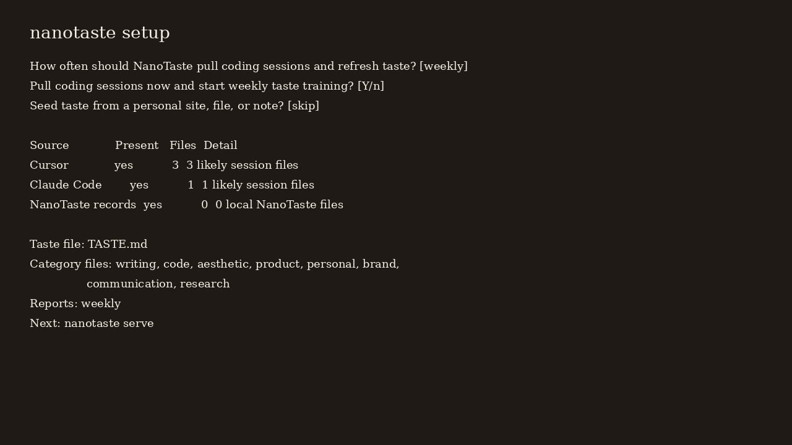
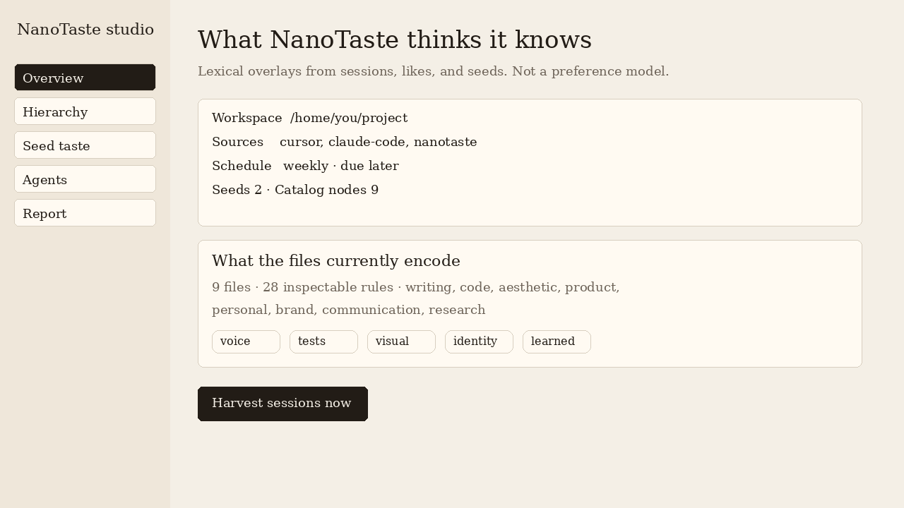

# AI Taste Research aka NanoTaste

Research tooling for testing whether a structured taste file changes how an agent selects and critiques generated outputs.

[](LICENSE)

This is a pre-alpha research repo, not a preference model or a finished agent. It explores a narrow question: can explicit taste rules make output selection easier to inspect and test? **NanoTaste** is the first harness—a small, local Python CLI that loads `TASTE.md`, compares candidate outputs, explains a deterministic choice, and records the run.

`v0.1.0-rc0` can now also discover local coding agents on first run, harvest opted-in session history, let you pick or drop in examples you prefer, seed a hierarchy of taste files from a personal site or files, and open a localhost studio. That harvest is lexical pattern extraction. NanoTaste has not demonstrated human preference alignment.

The public explanation lives in [`website/`](website/index.html). The editor is `nanotaste serve`, not that marketing site.

`TASTE.md` is ordinary markdown with sections for anchors, principles, tradeoffs, forbidden moves, calibration examples, and update policy. Rules can be general or scoped to a domain such as writing, product, aesthetic, or code.

Taste discovery follows fixed rules. With `--taste-file PATH`, that file is loaded (plus a sibling `taste/<domain>.md`, or `<domain>.md` inside `--taste-dir`) and nothing else is searched. Without it, NanoTaste checks the working directory and then each parent directory, nearest first, for `TASTE.md` and `taste/<domain>.md`, and uses the first directory that has either. When rules come from a parent directory, a note is printed on stderr so a wrapper's taste file cannot influence a run silently. When nothing is found, the command fails instead of quietly scoring with no rules; pass `--no-taste` to run an explicit no-rules baseline.

## Get started in four steps

NanoTaste requires Python 3.11 or newer. It is not on PyPI; install it from a clone of this repository.

```bash
python3 -m venv .venv
. .venv/bin/activate
python -m pip install .
nanotaste setup
```

`nanotaste` with no arguments starts setup on a TTY when the workspace is new. Non-interactive install:

```bash
nanotaste setup --yes --every weekly --seed-url https://example.com/about
nanotaste serve
```

That is the whole first-run loop:

1. Discover Cursor, Claude Code, Codex, Continue, Aider, Windsurf, Cline, Gemini CLI, Zed, OpenHands, Amazon Q, GitHub Copilot, git history, and existing NanoTaste records.
2. Ask how often to pull those sessions (`manual`, `daily`, `weekly`, or `monthly`) and whether to harvest now.
3. Write `TASTE.md` plus seeded category files under `taste/`.
4. Optionally seed a personal site, file, image, or note; then open the local studio.



Captured output from a real `--yes` run is in [`examples/setup-walkthrough.md`](examples/setup-walkthrough.md). A short video of the same path is in [`docs/assets/taste-setup-walkthrough.mp4`](docs/assets/taste-setup-walkthrough.mp4) and on [the marketing how-it-works page](website/how-it-works.html).

## The taste hierarchy

The main file is an index. Category files hold the seeded rules. Scheduled harvest writes overlays under `taste/learned/` and does not overwrite the seeds unless you pass `nanotaste learn --apply`.

```text
TASTE.md
taste/writing.md
taste/code.md
taste/aesthetic.md
taste/product.md
taste/personal.md
taste/brand.md
taste/communication.md
taste/research.md
taste/learned/*.md
```

```bash
nanotaste catalog
nanotaste seed --url https://example.com/about
nanotaste seed --file ~/Pictures/mood.png --caption "Restrained paper and ink"
nanotaste seed --text "Prefer short names and concrete bios."
```

See [`examples/hierarchy/`](examples/hierarchy/README.md) for the documented tree. Packaged seeds live in `src/nanotaste/data/taste/`.

## Local studio

```bash
nanotaste serve
# http://127.0.0.1:7468
```

The studio shows the hierarchy, tags, what the files currently encode, coding-agent discovery, the latest report, and a seed box for URLs, notes, files, and images.



This app is local only. The marketing site in `website/` does not read your sessions.

## Everyday loop

```bash
nanotaste harvest              # pull sessions, refresh overlays, write a report
nanotaste like PATH            # drop in something you prefer
nanotaste unlike PATH          # drop in something to avoid
nanotaste pick --candidate A --candidate B
nanotaste prefer --like good.md --unlike bad.md
nanotaste report               # generate a report now
nanotaste schedule --every weekly --install
```

`harvest` ingests opted-in history, extracts lexical signals, refreshes learned overlays, and writes `.nanotaste/reports/latest.md`. It redacts tokens, emails, and home-path usernames. It does not rewrite seeded `TASTE.md` or `taste/*.md` unless you pass `--apply` after review.

### Drop in a like or unlike

- [`examples/likes/concrete-release-note.md`](examples/likes/concrete-release-note.md)
- [`examples/unlikes/generic-ai-prose.md`](examples/unlikes/generic-ai-prose.md)
- [`examples/sessions/cursor-sample.jsonl`](examples/sessions/cursor-sample.jsonl)

```text
$ nanotaste like examples/likes/concrete-release-note.md
Stored like: .nanotaste/likes/concrete-release-note.md

$ nanotaste unlike examples/unlikes/generic-ai-prose.md
Stored unlike: .nanotaste/unlikes/generic-ai-prose.md

$ nanotaste pick --prompt "Write a launch note" \
    --candidate "Run three concrete drafts and record the decision." \
    --candidate "This seamlessly empowers teams." \
    --choose 1
Preferred candidate #1
Run three concrete drafts and record the decision.
```

### Reports, manual or scheduled

```text
$ nanotaste schedule --every weekly
Session harvest frequency: weekly
Crontab snippet: .nanotaste/schedule.cron
```

The snippet is:

```cron
15 9 * * 1 cd /path/to/your/project && nanotaste harvest --if-due
```

A real report from that loop is checked in at [`examples/reports/sample-taste-report.md`](examples/reports/sample-taste-report.md). The matching learned proposal is [`examples/learned/proposal.example.md`](examples/learned/proposal.example.md).

```text
$ nanotaste harvest
Harvested 23 session excerpts
Learned proposal: .nanotaste/learned/proposal.md
Updated overlays: 6
Report: .nanotaste/reports/latest.md
```

## How the critic works

`TASTE.md` is ordinary markdown with sections for anchors, principles, tradeoffs, forbidden moves, calibration examples, and update policy. Rules can be general or scoped to a domain such as writing, product, aesthetic, or code. NanoTaste searches upward from the working directory for the file, or you can pass one explicitly with `--taste-file`. Domain companions under `taste/` and `taste/learned/` are loaded with it.

```text
TASTE.md + category files + learned overlays
          |
          v
   load relevant rules       candidate outputs
          |                         |
          +------------+------------+
                       v
             deterministic critic
                       |
          +------------+-------------+
          v                          v
 selected text + reasons     .nanotaste/runs.jsonl
```

You can supply candidates from another model or tool. If you do not, NanoTaste's built-in generator creates two to four deterministic, synthetic drafts for local smoke tests. It does not call a model.

The critic is deliberately simple:

- each matching forbidden rule subtracts 3 points; a forbidden word of four or more letters also matches its simple inflections (`-s`, `-es`, `-ed`, `-ing`, `-ly`, `-ness`, and `-d`/`-ing` for words ending in `e`), so `"seamless"` catches `seamlessly` and `"empower"` catches `empowered`, while a match preceded within 50 characters by a negation such as "avoid" or "not" is ignored;
- eligible word overlap with a positive rule adds 1 or 2 points for that rule, with positive matches capped at 6 points total;
- positive credit is further capped at the number of eligible words the candidate has that are *not* copied from the rules (the echo guard), so a draft assembled from taste-file vocabulary earns nothing for it;
- a number, amount, percentage, day, or time unit adds 1 concrete-detail point;
- sharing a word of five or more letters with the prompt adds 1 stays-on-brief point; and
- a tie goes to the earlier candidate, and the readable output says so.

Eligible words are four or more characters after a small stop-word filter. The same inputs produce the same score and selection.

That score is not a probability, confidence value, or measure of quality. The critic does not understand intent, train a preference model, or recognize a good paraphrase unless the words happen to match. The inflection list is a fixed suffix table, not stemming, and the echo guard only stops trivial keyword stuffing; a draft padded with filler around rule words still scores. Its job is to provide an inspectable baseline that a later experiment can beat.

A normal run prints the selected candidate and its score reasons, then appends a JSONL record containing the prompt, normalized domain, taste-file hash, selected candidate, rejected candidates, and their reasons. Before the record is written, strings that look like credentials (OpenAI/Anthropic-style `sk-` keys, GitHub, AWS, Slack, and Google tokens, JWTs, bearer tokens, PEM private keys, and `api_key=...` style assignments) are replaced with `[REDACTED-...]` markers; terminal output is not altered, and the pattern list is a footgun guard rather than a secret scanner. Pass `--no-record` when you do not want the local record. Edits can also become pending taste-update proposals, but NanoTaste never rewrites `TASTE.md` automatically.

## Compare two drafts

Check the install with `nanotaste --version` (prints `nanotaste 0.1.0rc0`) and `nanotaste --help`.

Create `TASTE.md` in your working directory, or use the public template in [`examples/TASTE.example.md`](examples/TASTE.example.md):

```markdown
# TASTE.md

## Principles

### writing
- Prefer concrete drafts and visible decisions.

## Forbidden Moves

### writing
- "seamless"
```

```bash
nanotaste run \
  --taste-file TASTE.md \
  --domain writing \
  --prompt "Write a release note for NanoTaste" \
  --candidate "NanoTaste helps teams seamlessly compare outputs." \
  --candidate "Run NanoTaste on three concrete drafts and record the decision."
```

Output from an actual run:

```text
Selected candidate #1 (score 3)
- +2 matches taste: concrete, drafts
- +1 stays on brief

Run NanoTaste on three concrete drafts and record the decision.
```

The second draft wins because it overlaps with two words in the positive writing rule and stays on the prompt. The first draft is penalized because the forbidden word `seamless` matches `seamlessly`. That is the whole claim: the file changed this deterministic lexical comparison. It does not show that NanoTaste agrees with a person.

Candidates can also come from files. `nanotaste run --candidate-file draft-a.md --candidate-file draft-b.md ...` scores files (after any inline `--candidate` values, in the order given), and `nanotaste compare --candidates draft-a.md draft-b.md ...` does the same for an existing set of files. Candidate files, and the `--before`/`--after` files of `propose-update`, must be regular UTF-8 files that resolve inside the working directory after following symlinks; `nanotaste compare --candidates /etc/passwd ...` fails instead of echoing the file. Pass `--allow-outside-paths` to read files from elsewhere on purpose. `--taste-file` is always treated as a deliberate choice and may point anywhere.

Every command and flag has a description in `nanotaste <command> --help`, including `calibrate prepare`/`calibrate evaluate` for manual calibration packets and `propose-update` for pending taste-update proposals.

## Calibration is synthetic

`nanotaste calibrate prepare` writes a review sheet, a picks template, and NanoTaste's own picks; `nanotaste calibrate evaluate` reports how often a reviewer agreed with those picks. Unless the prompt set supplies its own candidates, the drafts being judged are the built-in generator's synthetic output: one deliberately generic filler draft plus two or three templated concrete ones. The agreement rate therefore measures whether a human and a lexical rule set both dislike the same planted filler. It is a workflow smoke test, not evidence of taste alignment or a preference study, and it should not be quoted as an accuracy result. The starter prompt set in [`data/calibration/starter_prompts.json`](data/calibration/starter_prompts.json) is smoke-test material for the same reason.

## Claim boundaries

RC0 demonstrates workflow mechanics only:

- it loads markdown taste rules and routes domain-specific sections;
- it generates synthetic candidates or accepts caller-supplied ones;
- it applies a deterministic lexical score and records reasons;
- it discovers local coding-agent paths and ingests opted-in history as redacted excerpts;
- it installs a seeded taste-file hierarchy and can seed overlays from URLs, files, images, or notes;
- it prepares manual calibration packets, likes, picks, and taste reports; and
- it writes proposed taste updates and learned overlays for later human review.

What remains unproven matters more:

- NanoTaste has not demonstrated human preference alignment.
- It does not learn or train a preference model.
- The critic has not been calibrated against held-out human judgments.
- Starter prompts and synthetic candidates are not research-grade evaluation data, and calibration agreement rates against them are not evidence of alignment.
- Scores and score margins are not probabilities, confidence, or uncertainty estimates.
- The critic is lexical and can be gamed: the echo guard stops trivial keyword stuffing, not padded stuffing, and the built-in generator's filler draft is only rejected when the loaded rules forbid its phrases for the run's domain.
- The current calibration bundle does not physically separate reviewer and private data.
- Upward discovery can still read a parent directory's taste file; NanoTaste now prints a stderr note when that happens and fails when no taste file exists, but only `--taste-file` pins the source.
- Record redaction covers a fixed list of credential shapes; anything else you paste into a candidate is stored verbatim.
- Local tests are not hosted CI evidence, and historical model reviews are advisory snapshots.
- Image seeds use captions and filenames. There is no vision model.

The authoritative boundary is [`docs/RC0_CLAIMS.md`](docs/RC0_CLAIMS.md). Any broader result needs new evidence and a separate review.

## Status

`v0.1.0-rc0` is a pre-alpha, repository-only release candidate. NanoTaste runs locally on Python 3.11+ and has no runtime dependencies. It is not published to PyPI. External replay candidates, blind review, held-out human labels, validated preference claims, Hermes Agent, and OpenClaw remain future work.

## Contributing

Start with [`CONTRIBUTING.md`](CONTRIBUTING.md). Keep issues, examples, and experiment data public-safe: no personal taste files, private prompts, secrets, or strategy notes.

## License

MIT — see [`LICENSE`](LICENSE).

Repository: [github.com/myrrazor/ai-taste-research](https://github.com/myrrazor/ai-taste-research)
